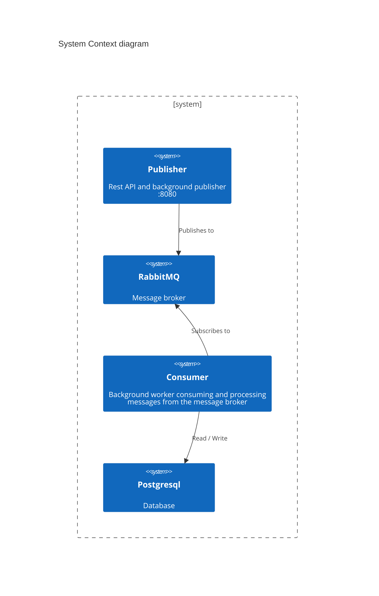
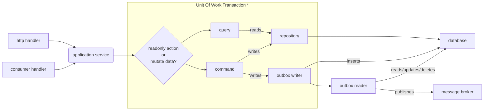

# Introduction

<!--toc:start-->
- [Introduction](#introduction)
  - [Getting started](#getting-started)
  - [Guiding Principles](#guiding-principles)
  - [Architecture Overview](#architecture-overview)
  - [Software Architecture Flow](#software-architecture-flow)
    - [Demo concepts](#demo-concepts)
    - [Dev tool dependencies](#dev-tool-dependencies)
<!--toc:end-->

This repository is a simple demo playground to test out golang publisher/consumer microservices using RabbitMQ as a message broker and docker with hot reload using air.

## Getting started

Open this repository in your favorite code editor and use `docker compose up` to startup the development stack and start coding. The go applications will be running within docker containers with the code mounted to be automatically detected for hot reload using [Air](https://github.com/air-verse/air)

## Guiding Principles

This repository is a simple showcase to practice and use as a reference. The goal is to learn and follow general good software principles found in various guidelines defined bellow.

- [The Twelve-Factor App](https://12factor.net)
- [Effective Go](https://go.dev/doc/effective_go)

## Architecture Overview



## Software Architecture Flow



_\*: Unit of work can be omitted if we only execute queries_

### Demo concepts

| ID | Name | Status |
| - | - | - |
| 1 | Code live reload | x |
| 2 | Dev docker containers | x |
| 3 | Prod docker containers | x |
| 4 | Application configuration | x |
| 5 | Http Endpoint | x |
| 6 | Http Endpoint Versioning | x |
| 7 | Middleware | x |
| 8 | Dependency Injection | x |
| 9 | Structured Logging | x |
| 10 | OpenTelemetry Instrumentation | |
| 11 | Message Broker Publisher | x |
| 12 | Message Broker Consumer | x |
| 13 | Message Broker Outbox Pattern | x |
| 14 | Database query | x |
| 15 | Database updates | x |
| 16 | Database transactions | x |
| 17 | Database migrations | x |
| 18 | Database data seeding | |
| 19 | Saga Pattern | |
| 20 | Unit of Work Pattern | x |
| 21 | OpenAPI Documentation | x |
| 22 | Problem Details+json validation ([RFC 9457](https://datatracker.ietf.org/doc/html/rfc9457)) | x |
| 23 | Unit Test | x |
| 24 | Integration Test | x |
| 25 | CQRS (simple version) | x |
| 26 | CloudEvents |  |

### Dev tool dependencies

[sqlc](https://docs.sqlc.dev/en/latest/index.html)

```shell
go install github.com/sqlc-dev/sqlc/cmd/sqlc@latest
```

[swag](https://github.com/swaggo/swag)

```shell
go install github.com/swaggo/swag/cmd/swag@latest
```
