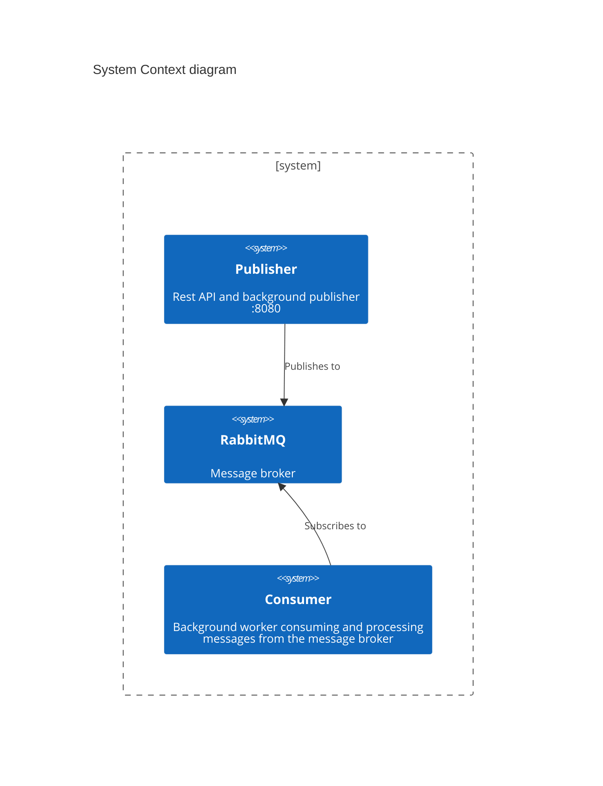

# Introduction

This repository is a simple demo playground to test out golang publisher/consumer microservices using RabbitMQ as a message broker and docker with hot reload using air.

## Getting started

Open this repository in your favorite code editor and use `docker compose up` to startup the development stack and start coding. The go applications will be running within docker containers with the code mounted to be automatically detected for hot reload using [Air](https://github.com/air-verse/air)

## Guiding Principles

This repository is a simple showcase to practice and use as a reference. The goal is to learn and follow general good software principles found in various guidelines defined bellow.

- [The Twelve-Factor App](https://12factor.net)
- [Effective Go](https://go.dev/doc/effective_go)

## Architecture Overview

### Demo concepts

| Name | Status |
| - | - |
| Code live reload | x |
| Dev docker containers | x |
| Prod docker containers | |
| Application configuration | x |
| Http Endpoint | x |
| Middleware | x |
| Dependency Injection | x |
| Structured Logging | x |
| Message Broker Publisher | x |
| Message Broker Consumer | x |
| Message Broker Outbox Pattern | |
| Message Broker Inbox Pattern | |
| Database query | |
| Database updates | |
| Database transactions | |
| Database migrations | |
| Database data seeding | |
| Unit Test | |
| Integration Test | |
